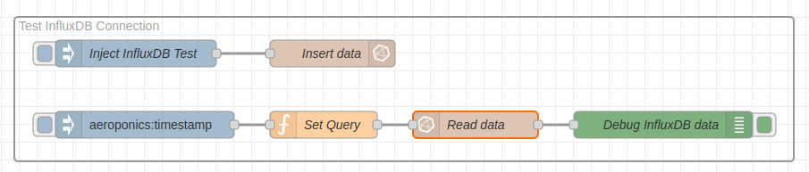
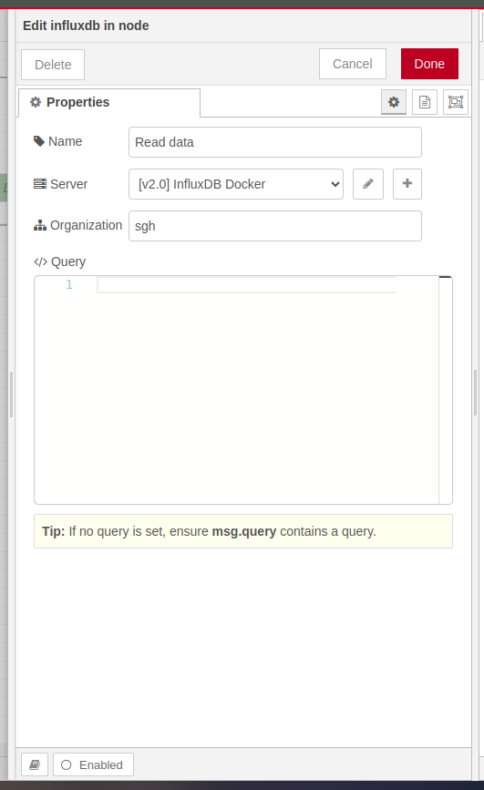
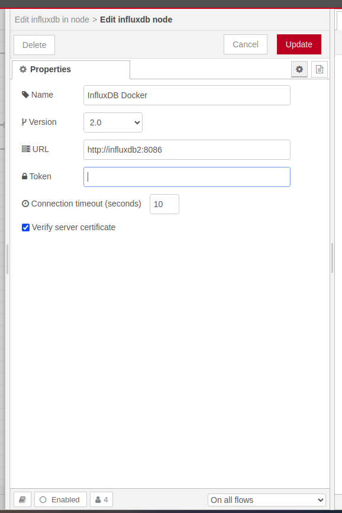

## Requirement

1. [Python](https://www.python.org/downloads/)
2. [Docker](https://docs.docker.com/get-started/get-docker/)
3. [Docker Compose](https://docs.docker.com/compose/)
4. [PM2](https://pm2.keymetrics.io/)

## Setup

1. Run command below for running docker on background

   ```bash
   docker compose up -d
   ```

   Note:
   With command above, you running:

   - [InfluxDB](https://docs.influxdata.com/influxdb/v2/get-started/): InfluxDB 2.7 is the platform purpose-built to collect, store, process and visualize time series data. Time series data is a sequence of data points indexed in time order. Data points typically consist of successive measurements made from the same source and are used to track changes over time.
   - [Node-red](https://nodered.org/docs/getting-started/): Node-RED is a programming tool for wiring together hardware devices, APIs and online services in new and interesting ways.
   - [Eclipse Mosquitto](https://mosquitto.org/): Eclipse Mosquitto is an open source (EPL/EDL licensed) message broker that implements the MQTT protocol versions 5.0, 3.1.1 and 3.1. Mosquitto is lightweight and is suitable for use on all devices from low power single board computers to full servers.

2. Install the necessary packages for Node-RED by running the command below.

   ```bash
   cd node-red && \
      npm i && \
      cd ..
   ```

3. Install Python and pip in node-red container.

   ```bash
   docker compose exec node-red sh
   ```

   In container shell

   ```bash
   apk add --update --no-cache python3 && ln -sf python3 /usr/bin/python
   apk add py3-pip
   ```

4. Create new InfluxDB API Token and copy it. **Make sure you copy new API Token. You won't be able to see it again!.** You can see the documentation [here](https://docs.influxdata.com/influxdb/v2/admin/tokens/).

5. Open node-red application in [localhost:11880](http://localhost:11880)

6. Paste API token in node influxDB and update it. See image below.
   
   
   

7. Last, Setup MQTT Broker and deploy it.
